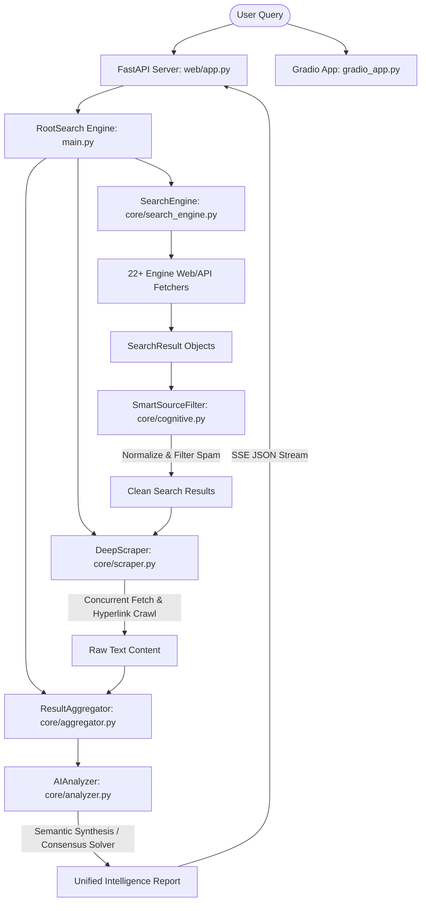

# FuckenSearch — AI Agent Developer Guide & Project Context
This file serves as the primary system-level context and onboarding guide for AI coding agents.

## 🎯 Project Overview
FuckenSearch (also known as RootSearch) is a highly concurrent, multi-mode deep search and analysis engine. It queries 22+ public search engines, academic portals, and community sites in parallel without requiring paid API keys, performs deep recursive web scraping, normalizes and filters data using AI-powered credibility scoring, and aggregates findings into a unified intelligence report.

---

## 🏗️ System Architecture & Workflow



---

## 📁 Directory Map & Component Overview

```
c:\Best Projects\FuckenSearch/
├── main.py              # RootSearch orchestrator class matching scraper, engine, and aggregator
├── config.py            # Global SearchConfig (Fathom S1 = 200, Fathom Max = 600)
├── requirements.txt     # Python project dependencies
├── app.py               # Unified multi-mode entry point for Gradio/FastAPI
├── run.py               # Launcher script for CLI, Web, or API
├── gradio_app.py        # HuggingFace Space Gradio interface
├── test_engines.py      # Quick search engine verification script
├── debug_engines.py     # Live diagnostic script for selectors
│
├── core/                # Core Search Engine & AI Logic
│   ├── net.py           # Global, domain-keyed aiohttp connection pools (1000 max concurrency)
│   ├── search_engine.py # Parallel fetchers for DuckDuckGo, Bing, Wikidata, arXiv, PubMed, etc.
│   ├── scraper.py       # Parallel URL extractor & BFS crawler (Abyss & Lightning Engines)
│   ├── cognitive.py     # AI Cognitive layer, DomainCredibilityScorer, and SmartSourceFilter
│   ├── k_trusted.py     # K-Trust authorization check & Mathematical Consensus Solver
│   ├── aggregator.py    # BM25 relevance scoring, deduplication, and ranking algorithm
│   └── analyzer.py      # AI prompt synthesis, query intent classification, and subquery expansion
│
├── web/                 # FastAPI Web Application
│   ├── app.py           # REST APIs & 5-Stage Live SSE stream (/api/search/stream)
│   ├── static/          # Frontend JavaScript (script.js), CSS, and styles
│   └── templates/       # HTML layouts (index.html)
│
├── cli/                 # Terminal Console UI
│   └── terminal.py      # Interactive command-line search mode
│
└── tests/               # Automated Unit Test Suites
    ├── test_core.py     # Asserts core aggregations and search sorting
    ├── test_cognitive.py# Asserts Domain Credibility and Smart Filtering
    ├── test_fathom_max.py# Asserts Fathom S1/Max limit validations
    └── test_performance.py # 100 dynamic performance and load-tolerance tests
```

---

## ⚙️ Concurrency & Scale Limits
The search engine is configured with high-performance parameters designed for extensive coverage:
* **Fathom S1 (Lightning Engine)**:
  - Max source nodes: `200`
  - Mode: Highly concurrent shallow crawl
* **Fathom Max (Abyss Engine)**:
  - Max recursive crawl nodes: `600`
  - Max crawl depth: `4`
  - Mode: Deep recursive hyperlink tracing with dynamic link extraction
* **Connection Pooling**:
  - Global `ClientSession` connection limit: `1000` (in `core/net.py`)
  - Target domains are queried with custom user agents and randomized jitter.

---

## 🛡️ Data Integrity & Smart Filtering (SmartSourceFilter)
All discovered URLs pass through the `SmartSourceFilter` in `core/cognitive.py`:
1. **Strict Normalization**: Domain paths are lowercased, and tracking variables (`utm_*`, `fbclid`, etc.) are stripped. Double-checks case-sensitivity (e.g. `WWW.Example.Com` becomes `example.com`).
2. **Spam Keyword Blocking**: Domain names and content snippets are evaluated against keyword dictionaries (e.g. `casino`, `slots`, `adult video`, `viagra`, `affiliate`) to immediately discard untrusted sources.
3. **Credibility Scoring**: Domains are weighted by Tier:
   - *Tier 1 (1.0)*: `.gov`, `.edu`, and verified organizations.
   - *Tier 2 (0.7)*: Reputable journals, news outlets (Reuters, BBC), and knowledge repos.
   - *Tier 3 (0.3)*: General web resources.
4. **Consensus Solving**: Matches numeric facts (heights, percentages, years) strictly using a mathematical solver. Rejects claims that conflict with verified numbers.

---

## 🚦 How to Run Tests & Verify Changes
Verify all files and modifications by running the unit test and performance benchmark suite:

```bash
# Run the complete test suite (includes 47 core/cognitive tests + 100 performance tests)
python -m unittest discover -s tests

# Run performance tests specifically (validates 200/600 scale under concurrent load)
python -m unittest tests/test_performance.py
```
